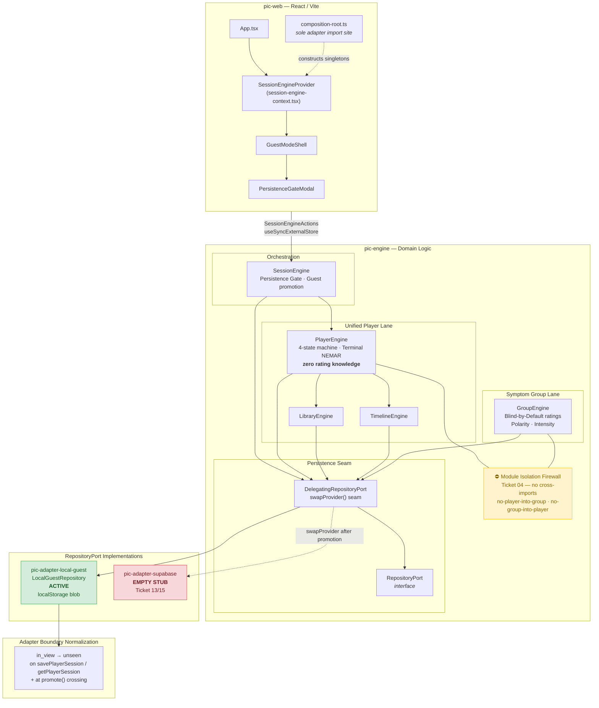
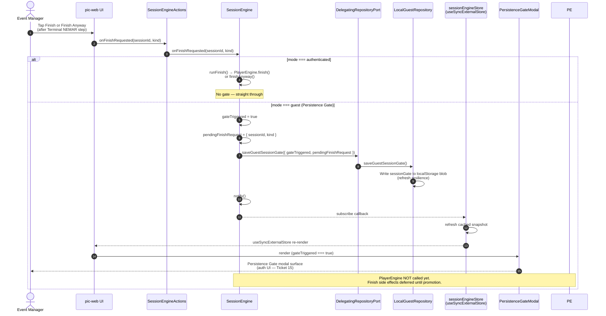
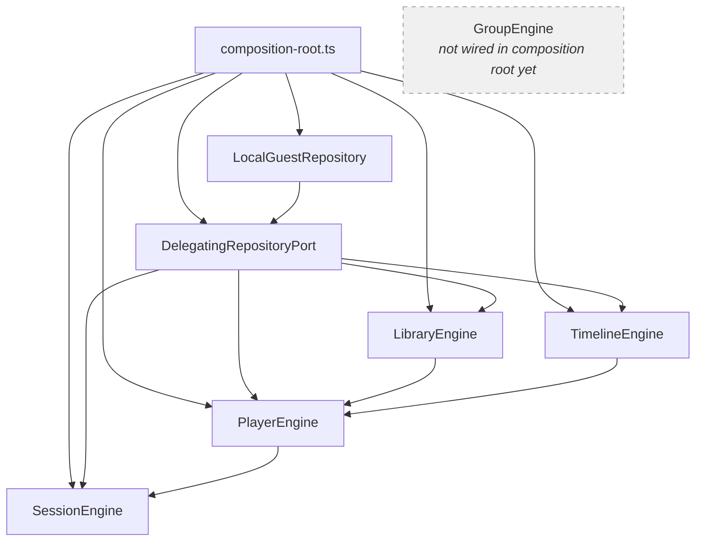

# PiC Tracer Bullet — As-Built Architecture Blueprint (Waves 0–7.5)

This document captures the **current** architecture of the PiC Tracer Bullet after Waves 0–7.5. It is an as-built record, not a target-state proposal.

**Scope:** Monorepo packages `pic-web`, `pic-engine`, `pic-adapter-local-guest`, and `pic-adapter-supabase` (empty stub).

---

## 1. Static System Topology (C4-Style Block Diagram)

The diagram below shows package boundaries, engine modules inside `pic-engine`, the persistence seam (`RepositoryPort` + `DelegatingRepositoryPort`), active vs stub adapters, and the **Player ↔ Group firewall** enforced by Ticket 04 (dependency-cruiser + source-scan tests).

### Topology Notes

| Layer | Responsibility |
|-------|----------------|
| **pic-web** | Dumb Reflection UI. Components read `SessionEngine` state via `useSyncExternalStore`; mutations go through `SessionEngineActions`. Only `composition-root.ts` may import adapter packages. |
| **SessionEngine** | Guest vs authenticated mode, Persistence Gate orchestration, deferred `finish()` / `finishAnyway()` replay after promotion. Never imports `GroupEngine`. |
| **PlayerEngine** | Unified Player state machine (`unseen` / `in_view` / `skipped` / `completed`), Navigation Tree jumps, mandatory **Terminal NEMAR**, sovereign `finish()` / `finishAnyway()`. Blind-by-Default: no `Symptom`, `Polarity`, or `Intensity` awareness. |
| **GroupEngine** | Sole owner of symptom ratings and Blind-by-Default reveal API. Never imports `PlayerEngine`. |
| **LibraryEngine / TimelineEngine** | Personal Treatment Library `use_count` and multitype Timeline append — shared by `PlayerEngine.finish()`. |
| **DelegatingRepositoryPort** | All engines hold a reference to one wrapper instance. `swapProvider()` retargets persistence after guest promotion without reconstructing engines (Wave 7.5). |
| **LocalGuestRepository** | Active adapter. Single JSON blob in `localStorage` (`pic:guest-repository:v1`). Normalizes ephemeral `in_view` at the permanent-store boundary. |
| **pic-adapter-supabase** | Empty stub. Real RPC promotion lands in Ticket 13; authenticated adapter wiring in Tickets 15/20. |

---

## 2. Dynamic Flow — Persistence Gate Lifecycle (Wave 7.5)

When an **Event Manager** (EM) in **Guest Mode** requests **Finish** (סיום) or the sovereign **[Finish Anyway]** bypass, the Persistence Gate intercepts the call. The gate intent is persisted to `localStorage` for **refresh resilience** (DEC-017). The UI subscribes to `gateTriggered` and renders `PersistenceGateModal`.

Authenticated mode bypasses the gate and calls `PlayerEngine` directly.

### Post-Gate Paths (not shown above)

| Path | Behavior |
|------|----------|
| **promote()** | Calls `promoteGuestToAccount` RPC (stub throws today). On success: `onPromotionSucceeded` → `swapProvider`, `mode = authenticated`, clears gate flags, replays deferred `finish()` / `finishAnyway()`. |
| **discardGuestState()** | Clears gate flags via `saveGuestSessionGate`; no server contact; session stays **Integrating** (not failure-framed). |
| **Page reload** | `composition-root` rehydrates `initialGateState` from `getGuestSessionGateSync()` so Finish intent survives refresh. |

---

## 3. Composition Root & Dependency Injection

`composition-root.ts` is the **single composition point** in `pic-web`. ES module caching guarantees one process-wide singleton graph — nothing is reconstructed on React re-renders.

```mermaid
flowchart LR
  subgraph BOOT["Module Load — composition-root.ts"]
    direction TB

  LG_INST["new LocalGuestRepository()"]
  DRP_INST["new DelegatingRepositoryPort(guestRepository)"]
  LE_INST["new LibraryEngine(repositoryPort)"]
  TE_INST["new TimelineEngine(repositoryPort)"]
  PE_INST["new PlayerEngine(repositoryPort,<br/>libraryEngine, timelineEngine)"]
  SE_INST["new SessionEngine(repositoryPort,<br/>playerEngine, options)"]

  LG_INST --> DRP_INST
  DRP_INST --> LE_INST
  DRP_INST --> TE_INST
  LE_INST --> PE_INST
  TE_INST --> PE_INST
  DRP_INST --> PE_INST
  DRP_INST --> SE_INST
  PE_INST --> SE_INST
  end

  subgraph OPTIONS["SessionEngineOptions"]
    INIT["initialGateState:<br/>guestRepository.getGuestSessionGateSync()"]
    PROMO["onPromotionSucceeded:<br/>repositoryPort.swapProvider(authenticatedPort)"]
  end

  subgraph REACT["React Wiring"]
    STORE["createExternalStore(getState)"]
    SUB["sessionEngine.subscribe → store.notify()"]
    PROVIDER["SessionEngineProvider"]
    HOOK_R["useSessionEngineState()"]
    HOOK_A["useSessionEngineActions()"]
  end

  subgraph FUTURE["Ticket 13 / 15 Promotion Seam"]
    SWAP_FN["swapToSupabaseAdapter(port)"]
    AUTH_PORT["authenticatedPort = port<br/>(set before promote)"]
    SWAP_PROV["DelegatingRepositoryPort.swapProvider()"]
  end

  OPTIONS --> SE_INST
  SE_INST --> SUB
  SUB --> STORE
  STORE --> HOOK_R
  SE_INST --> HOOK_A
  PROVIDER --> HOOK_R
  PROVIDER --> HOOK_A

  SWAP_FN --> AUTH_PORT
  AUTH_PORT --> SWAP_PROV
  SWAP_PROV --> DRP_INST

  classDef future fill:#e7f1ff,stroke:#0d6efd,color:#084298
  class SWAP_FN,AUTH_PORT,SWAP_PROV future
```

### Dependency Graph (engines → port)

`GroupEngine` is implemented and tested inside `pic-engine` but is **not yet instantiated** in `composition-root.ts` — symptom-group screens land in later tracer tickets (16–19). The Player ↔ Group firewall still holds: neither engine imports the other.

---

## Architectural Notes

### Test Coverage — 109 Passing

The tracer bullet CI suite currently reports:

| Metric | Value |
|--------|-------|
| Test files | 9 passed |
| Tests | **109 passed**, 5 skipped (114 total) |
| Contract suite | Fake `RepositoryPort` contract tests (Ticket 03) |
| Isolation scanner | Source-scan + bare-identifier ban for Player/Group firewall |

Coverage spans: `RepositoryPort` contract, all five engines (`GroupEngine`, `LibraryEngine`, `TimelineEngine`, `PlayerEngine`, `SessionEngine`), `LocalGuestRepository`, isolation scanner unit tests, and `pic-web` app-shell wiring.

### Zero Depcruise Violations

`npm test` runs `depcruise` in both `pic-engine` and `pic-web` workspaces:

| Package | Modules | Dependencies | Violations |
|---------|---------|--------------|------------|
| `pic-engine` | 63 | 174 | **0** |
| `pic-web` | 286 | 472 | **0** |

Key enforced rules include Ticket 04 module isolation (`no-player-into-group`, `no-group-into-player`) and Ticket 14's adapter-import firewall (only `composition-root.ts` may import `pic-adapter-local-guest` or `pic-adapter-supabase`).

### Design Constraints Reflected Above

1. **`in_view` normalization** — `PlayerEngine` may write `in_view` during in-process session transitions. `LocalGuestRepository` downgrades `in_view → unseen` at the adapter boundary on save/read. `SessionEngine.normalizeForPermanentStore()` applies the same rule at the guest-to-account promotion crossing.
2. **Blind-by-Default** — `GroupEngine` is the sole rating owner. `PlayerEngine` imports only `PlayerSession` and `PlayerUnit` from domain types — never `Symptom`, `Polarity`, or `Intensity`.
3. **Integrating, not failure** — Mid-session exits and Terminal NEMAR "No" responses mark sessions as **Integrating** (בהטמעה), not failed. `[Finish Anyway]` is always sovereign.
4. **Persistence Gate (DEC-017)** — Guest inquiry is a full Value Moment with no account required. Authentication is demanded only when the EM tries to **anchor** work — Finish, journal sync, or explicit persist — never to start inquiry.

---

## Related Documents

- [`CLAUDE.md`](../../CLAUDE.md) — Product manifesto and pillar definitions
- [`decisions.md`](../../decisions.md) — DEC-001 through DEC-017
- [`docs/audits/wave-4-audit.md`](../audits/wave-4-audit.md) — Wave 4 isolation audit
- [`docs/audits/wave-5-wave-7-audit.md`](../audits/wave-5-wave-7-audit.md) — Session engine and composition root audit
- [`packages/pic-web/src/composition-root.ts`](../../packages/pic-web/src/composition-root.ts) — Live composition root
